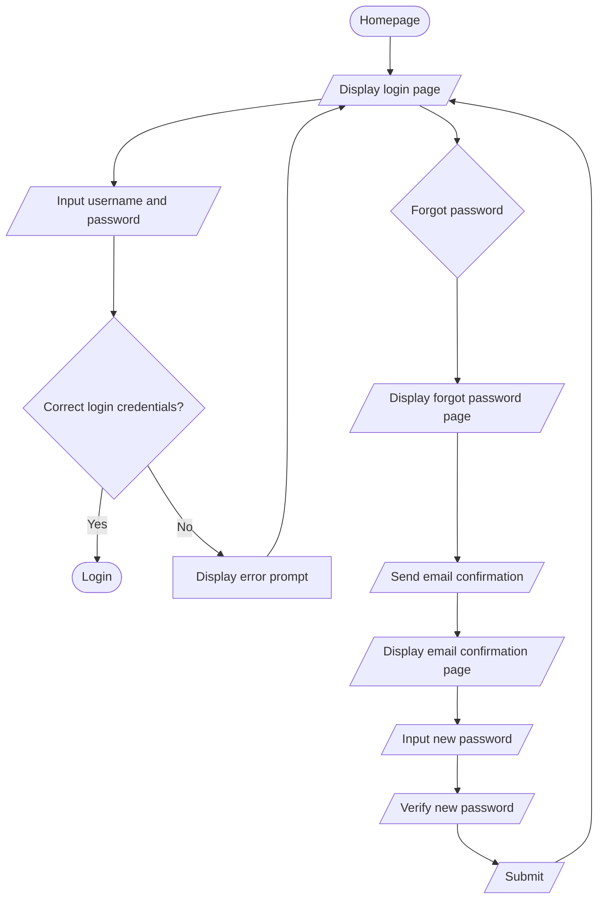

```mermaid
flowchart TD
    A([Homepage]) --> B[/Display login page/]
    B --> C[/Input username and password/]
    C --> D{Correct login credentials?}
    D --> |Yes| E([Login])
    D --> |No| F[Display error prompt]
    F --> B
    B --> G{Forgot password}
    G --> H[/Display forgot password page/]
    H --> I[/Send email confirmation/]
    I --> J[/Display email confirmation page/]
    J --> K[/Input new password/]
    K --> L[/Verify new password/]
    L --> M[/Submit/]
    M --> B
```
